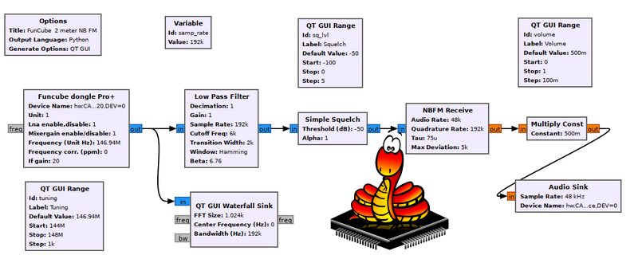

(This project, including the readme, was generated by an LLM)
# uGNURadio: MicroPython Edition

uGNURadio is a lightweight and efficient implementation of the GNURadio framework for MicroPython. It allows you to build and execute signal processing applications on resource-constrained devices such as microcontrollers.

## Features

- **Flowgraph-based Architecture**: uGNURadio follows the same flowgraph-based architecture as GNURadio, enabling you to create complex signal processing applications by connecting blocks together.

- **Blocks Library**: uGNURadio provides a collection of commonly used signal processing blocks, including:
  - Signal Sources: Sine wave, square wave, noise generator, etc.
  - Filters: FIR filter, IIR filter, band-pass filter, low-pass filter, etc.
  - Modulators/Demodulators: AM, FM, PSK, QAM, etc.
  - Math Operations: Addition, multiplication, division, etc.
  - Fourier Analysis: FFT, IFFT, spectral analysis, etc.
  - Sinks: File sink, UDP sink, device sink (PWM, I2S, etc.), GUI sink, etc.

- **Device Integration**: uGNURadio seamlessly integrates with MicroPython-compatible devices, allowing you to interact with hardware peripherals such as ADC, DAC, PWM, I2C, SPI, and more.

- **Efficient Execution**: The framework is optimized for efficient execution on resource-constrained devices, making it suitable for real-time signal processing applications.

- **Extensibility**: uGNURadio provides a simple and intuitive API for creating custom blocks, enabling you to extend the functionality of the framework to meet your specific requirements.

## Supported Blocks

uGNURadio supports a wide range of signal processing blocks, including:

- Signal Sources: `SigSource`, `NoiseSource`, `FileSource`, `DeviceSource`, etc.
- Filters: `FIRFilter`, `IIRFilter`, `BandpassFilter`, `LowpassFilter`, etc.
- Modulators/Demodulators: `AMModulator`, `AMDemodulator`, `FMModulator`, `FMDemodulator`, `PSKModulator`, `PSKDemodulator`, etc.
- Math Operations: `Add`, `Multiply`, `Divide`, `Subtract`, etc.
- Fourier Analysis: `FFT`, `IFFT`, `Spectrogram`, etc.
- Sinks: `FileSink`, `UDPSink`, `DeviceSink`, `GUISink`, etc.
- Miscellaneous: `Throttle`, `Delay`, `Threshold`, `Selector`, `Probe`, etc.

For a complete list of supported blocks and their usage, please refer to the documentation.

## Test Coverage

uGNURadio comes with a comprehensive test suite to ensure the reliability and correctness of the implemented blocks. The test suite covers various aspects of each block, including:

- Unit tests for individual block functionality
- Integration tests for block connectivity and data flow
- Edge case tests for handling special scenarios and error conditions
- Performance tests to measure block execution time and resource utilization

The test suite is continuously expanded and updated to maintain high test coverage and catch any regressions or issues.

## Demos and Use Cases

uGNURadio provides a collection of demo applications and use cases to showcase the capabilities of the framework. Some notable demos include:

- **Analog Signal Processing**: Demonstrates how to read analog signals from ADC pins, process them using filters and math operations, and output the result to PWM or DAC pins.

- **Digital Signal Processing**: Shows how to perform digital signal processing tasks such as modulation, demodulation, and spectral analysis using uGNURadio blocks.

- **Sensor Data Acquisition**: Illustrates how to acquire data from sensors connected via I2C or SPI, process the data using uGNURadio blocks, and transmit the results over UDP or store them in files.

- **Audio Processing**: Demonstrates real-time audio processing capabilities, including filtering, equalization, and effects using uGNURadio blocks and audio peripherals like I2S.

- **Software-Defined Radio**: Showcases how to build a simple software-defined radio (SDR) application using uGNURadio, allowing you to receive and process radio signals.

These demos serve as starting points and inspiration for building your own signal processing applications using uGNURadio on MicroPython-compatible devices.

## Getting Started

To get started with uGNURadio, follow these steps:

1. Install MicroPython on your target device.
2. Clone the uGNURadio repository: `git clone https://github.com/your-username/ugnuradio.git`
3. Upload the uGNURadio library files to your device.
4. Create a new MicroPython script and import the necessary uGNURadio blocks.
5. Build your signal processing flowgraph by connecting the blocks together.
6. Execute the script on your device and observe the results.

For detailed installation instructions, usage guidelines, and API reference, please refer to the documentation.

## Contributing

Contributions to uGNURadio are welcome! If you find any issues, have suggestions for improvements, or want to add new features, please open an issue or submit a pull request on the GitHub repository.

When contributing, please adhere to the coding style guidelines and ensure that your changes are well-tested and documented.

## License

uGNURadio is released under the [MIT License](LICENSE). You are free to use, modify, and distribute the software in accordance with the terms and conditions of the license.

## Acknowledgments

uGNURadio is inspired by the GNURadio framework and aims to bring its powerful signal processing capabilities to the world of MicroPython and resource-constrained devices. We would like to acknowledge the GNURadio community for their excellent work and the MicroPython community for their support and contributions.

## Contact

For any questions, suggestions, or feedback, please contact the project maintainer at [your-email@example.com](mailto:your-email@example.com).

Happy signal processing with uGNURadio!